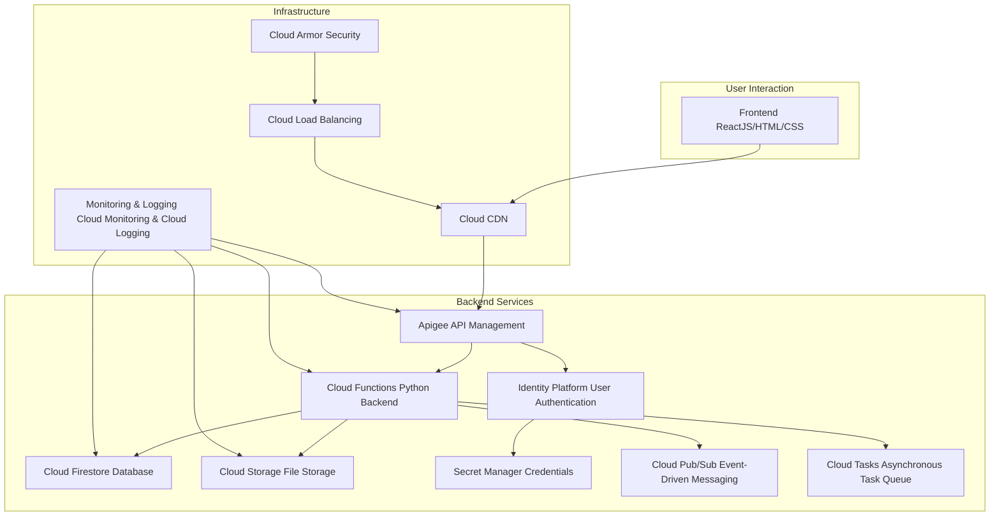

# Estrutura GCP para uma aplicação CRUD de cadastro de clientes

Essa estrutura foi desenhada para uma aplicação que realiza um CRUD (Create, Read, Update, Delete) de cadastro de clientes, com backend escrito em Python.

---

## **1. Camada de interação do usuário (Frontend):**
- **Frontend (ReactJS/HTML/CSS):**  
  Interface que os usuários veem e interagem. Utiliza ReactJS para ser dinâmica e moderna.
- **Cloud CDN:**  
  Melhora a velocidade de carregamento ao armazenar cópias do frontend em servidores distribuídos geograficamente, reduzindo a latência.

---

## **2. Camada de gerenciamento e APIs:**
- **Apigee (API Management):**  
  Gerencia as APIs do sistema, cuidando de autenticação, segurança, controle de tráfego e monitoramento de uso. Atua como um intermediário entre o frontend e os serviços backend.

---

## **3. Camada de Backend Services:**
- **Cloud Functions (Python Backend):**  
  Executa o código Python que processa as requisições do frontend e conecta os dados e serviços necessários.
- **Cloud Firestore (Database):**  
  Armazena os dados dos clientes (como nome, e-mail, etc.) de forma escalável e segura.
- **Cloud Storage (File Storage):**  
  Guarda arquivos que podem ser anexados pelos clientes, como fotos ou documentos.
- **Identity Platform (User Authentication):**  
  Gerencia a autenticação dos usuários, permitindo login seguro.
- **Secret Manager (Credentials):**  
  Armazena com segurança senhas e chaves de acesso usadas pelo backend.
- **Cloud Pub/Sub:**  
  Lida com mensagens ou eventos em tempo real, como notificações de alteração ou integração com outros sistemas.
- **Cloud Tasks:**  
  Garante que tarefas assíncronas, como envio de e-mails ou atualizações em lote, sejam processadas de forma confiável.

---

## **4. Camada de infraestrutura:**
- **Cloud Load Balancing:**  
  Distribui o tráfego de forma eficiente para evitar sobrecarga em um único serviço.
- **Cloud Armor:**  
  Protege contra ataques e bloqueia acessos não autorizados com políticas de segurança.
- **Monitoring & Logging:**  
  Monitora a aplicação e registra logs para detectar e resolver problemas rapidamente.

---

Essa estrutura é escalável, segura e projetada para facilitar a manutenção e o crescimento da aplicação no Google Cloud Platform.

