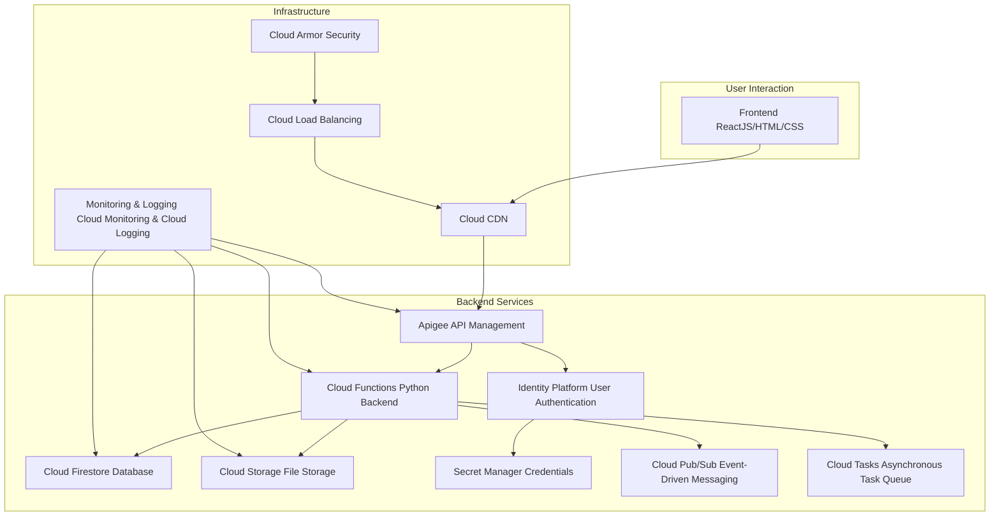

# Estrutura GCP para uma aplicação CRUD de cadastro de clientes

Essa estrutura foi desenhada para uma aplicação que realiza um CRUD (Create, Read, Update, Delete) de cadastro de clientes, com backend escrito em Python.

---

## **1. Camada de interação do usuário (Frontend):**
- **Frontend (ReactJS/HTML/CSS):**  
  Interface que os usuários veem e interagem. Utiliza ReactJS para ser dinâmica e moderna.
- **Cloud CDN:**  
  Melhora a velocidade de carregamento ao armazenar cópias do frontend em servidores distribuídos geograficamente, reduzindo a latência.

---

## **2. Camada de gerenciamento e APIs:**
- **Apigee (API Management):**  
  Gerencia as APIs do sistema, cuidando de autenticação, segurança, controle de tráfego e monitoramento de uso. Atua como um intermediário entre o frontend e os serviços backend.

---

## **3. Camada de Backend Services:**
- **Cloud Functions (Python Backend):**  
  Executa o código Python que processa as requisições do frontend e conecta os dados e serviços necessários.
- **Cloud Firestore (Database):**  
  Armazena os dados dos clientes (como nome, e-mail, etc.) de forma escalável e segura.
- **Cloud Storage (File Storage):**  
  Guarda arquivos que podem ser anexados pelos clientes, como fotos ou documentos.
- **Identity Platform (User Authentication):**  
  Gerencia a autenticação dos usuários, permitindo login seguro.
- **Secret Manager (Credentials):**  
  Armazena com segurança senhas e chaves de acesso usadas pelo backend.
- **Cloud Pub/Sub:**  
  Lida com mensagens ou eventos em tempo real, como notificações de alteração ou integração com outros sistemas.
- **Cloud Tasks:**  
  Garante que tarefas assíncronas, como envio de e-mails ou atualizações em lote, sejam processadas de forma confiável.

---

## **4. Camada de infraestrutura:**
- **Cloud Load Balancing:**  
  Distribui o tráfego de forma eficiente para evitar sobrecarga em um único serviço.
- **Cloud Armor:**  
  Protege contra ataques e bloqueia acessos não autorizados com políticas de segurança.
- **Monitoring & Logging:**  
  Monitora a aplicação e registra logs para detectar e resolver problemas rapidamente.

---

Essa estrutura é escalável, segura e projetada para facilitar a manutenção e o crescimento da aplicação no Google Cloud Platform.

Caso não esteja visualizando a organização da estrutura [clique aqui](GCP.png).

## **5. Orçamento:**

Para calcular o faturamento mensal do uso dessa estrutura no Google Cloud Platform, precisamos considerar os preços atuais dos serviços utilizados. Aqui está uma estimativa aproximada com base nos serviços mencionados:

### **1. Cloud Functions (Python Backend)**
- 100 execuções por dia = 3000 execuções por mês.
- Custo: $0.20 por milhões de execuções.
- Total: 0.003 * $0.20 = **$0.0006**

### **2. Cloud Firestore (Database)**
- 10 GB de dados armazenados.
- Custo: $0.18 por GB por mês.
- Total: 10 * $0.18 = **$1.80**

### **3. Cloud Storage (File Storage)**
- 10 GB de dados armazenados.
- Custo: $0.026 por GB por mês.
- Total: 10 * $0.026 = **$0.26**

### **4. Cloud CDN**
- 10 GB de dados entregues.
- Custo: $0.005 por GB.
- Total: 10 * $0.005 = **$0.05**

### **5. Apigee (API Management)**
- Assumindo 100 execuções por dia (simplificação para este cálculo).
- Custo: $0.01 por milhões de chamadas de API.
- Total: 0.003 * $0.01 = **$0.00003**

### **6. Identity Platform (User Authentication)**
- Assumindo 100 autenticações por dia (simplificação para este cálculo).
- Custo: $0.005 por milhões de autenticações.
- Total: 0.003 * $0.005 = **$0.000015**

### **7. Secret Manager (Credentials)**
- Assumindo 10 MB de dados (simplificação, 1 GB = 1024 MB).
- Custo: $0.10 por GB por mês.
- Total: (10 / 1024) * $0.10 = **$0.000976**

### **8. Cloud Pub/Sub (Event-Driven Messaging)**
- Assumindo 100 mensagens por dia (simplificação para este cálculo).
- Custo: $0.40 por milhões de mensagens.
- Total: 0.003 * $0.40 = **$0.0012**

### **9. Cloud Tasks (Asynchronous Task Queue)**
- Assumindo 100 tarefas por dia (simplificação para este cálculo).
- Custo: $0.10 por milhões de tarefas.
- Total: 0.003 * $0.10 = **$0.0003**

### **10. Cloud Load Balancing**
- 10 GB de dados entregues.
- Custo: $0.10 por GB.
- Total: 10 * $0.10 = **$1.00**

### **11. Cloud Armor (Security)**
- 10 GB de dados protegidos.
- Custo: $0.10 por GB.
- Total: 10 * $0.10 = **$1.00**

### **12. Monitoring & Logging (Cloud Monitoring & Cloud Logging)**
- Assumindo 10 GB de dados monitorados e registrados.
- Custo: $0.10 por GB.
- Total: 10 * $0.10 = **$1.00**

### **Total Estimado:**
Soma de todos os custos:
$0.0006 + $1.80 + $0.26 + $0.05 + $0.00003 + $0.000015 + $0.000976 + $0.0012 + $0.0003 + $1.00 + $1.00 + $1.00 = **$6.112121**

Portanto, o faturamento estimado para um mês de uso dessa estrutura no Google Cloud Platform seria aproximadamente **$6.11**. Essa é uma estimativa simplificada e os custos reais podem variar com base no uso específico e nas políticas de preços atuais da Google Cloud.

## **6. Conecte-se comigo:**

👨🏾‍💻